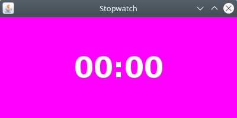

# Stopwatch Bot
This is a Clojure application that provides a stopwatch bot.

## Getting Started
These instructions will get you a copy of the project up and running on your local machine.

### Prerequisites
You need to have [Clojure](https://clojure.org/guides/install_clojure) installed on your machine. 

### Installation
Clone the repository:
```bash
git clone https://github.com/frankbuss/stopwatchbot.git
```
Navigate into the project directory:
```bash
cd stopwatchbot
```
Copy the template environment file to create your own config.edn:
```bash
cp config.edn.template config.edn
```
Open the config.edn file and change the login credentials, and allowed users who can use the `!sw` chat bot command. [Here](https://dev.twitch.tv/docs/authentication/getting-tokens-oauth/) is explained how to get the OAUTH token for Twitch. Optionally you can adjust the other settings as well.

## Usage
Start the bot by running the run.sh script:
```bash
./run.sh
```
You will see output like this:
```
Starting bot...
Connection established...
Sending token
Sending: NICK 10x_programmer
Sending: JOIN #10x_programmer
Sending: PRIVMSG #10x_programmer :stopwatch-bot ready

Received:  :tmi.twitch.tv 001 10x_programmer :Welcome, GLHF!
:tmi.twitch.tv 002 10x_programmer :Your host is tmi.twitch.tv
:tmi.twitch.tv 003 10x_programmer :This server is rather new
:tmi.twitch.tv 004 10x_programmer :-
:tmi.twitch.tv 375 10x_programmer :-
:tmi.twitch.tv 372 10x_programmer :You are in a maze of twisty passages, all alike.
:tmi.twitch.tv 376 10x_programmer :>
Received:  :10x_programmer!10x_programmer@10x_programmer.tmi.twitch.tv JOIN #10x_programmer
:10x_programmer.tmi.twitch.tv 353 10x_programmer = #10x_programmer :10x_programmer
:10x_programmer.tmi.twitch.tv 366 10x_programmer #10x_programmer :End of /NAMES list
```
and a window like this will open:



The magenta background (color `#ff00ff`) makes it easier to integrate it in OBS and to overlay it with transparent background, if desired. See [here](https://obsproject.com/kb/color-key-filter) how to do it.

From the chat where the bot has joined, you can now start the countdown. There are three ways to specify the time:

1. Seconds:
   - Example: `!sw 35` represents 35 seconds.

1. Minutes:Seconds:
   - Example: `!sw 2:45` represents 2 minutes and 45 seconds.

1. Hours:Minutes:Seconds:
   - Example: `!sw 1:15:30` represents 1 hour, 15 minutes, and 30 seconds.

On the terminal, you can also enter chat messages, which will be sent to the IRC server. You can stop the bot with ctrl-c.

## Run it in a Docker container
Clone this repository and create your own config.edn as described, then `cd` to the directory, and run this:
```
sudo xhost +local:root
docker run -e DISPLAY=$DISPLAY -v /tmp/.X11-unix:/tmp/.X11-unix:ro -w /usr/app -v `pwd`:/usr/app clojure bash -c "apt-get update && apt-get install -y libxrender1 libxtst6 libxi6 && ./run.sh"
```
The xhost command allows the local root user on your machine to connect to the X server. The docker command then installs the Clojure image, installs some libraries, mounts the current directory under `/usr/app`, and runs the program. The stopwatch window should appear on your screen. After ending the program, run this, to remove root access to the X server:
```
sudo xhost -local:root
```
But not really needed, if you are the only user of the computer.
